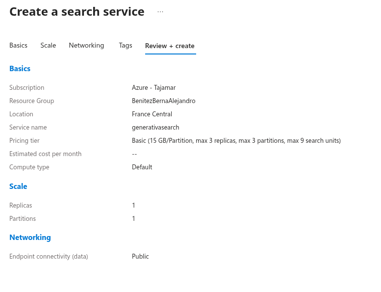
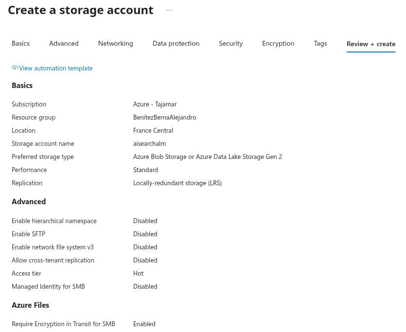
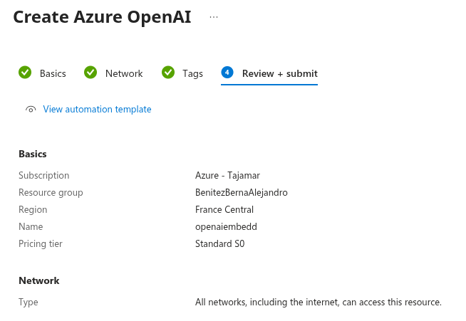
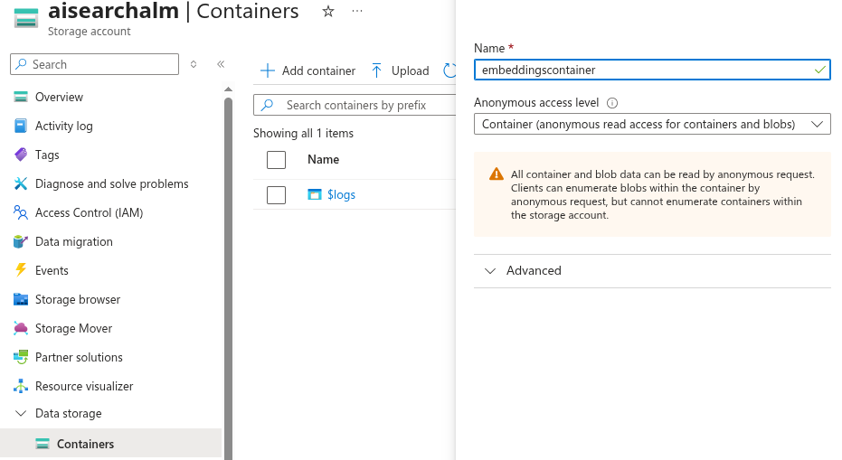
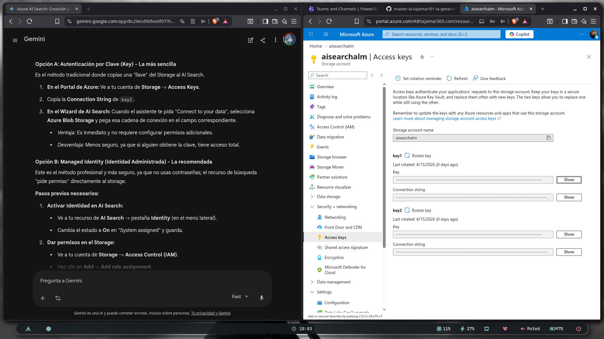
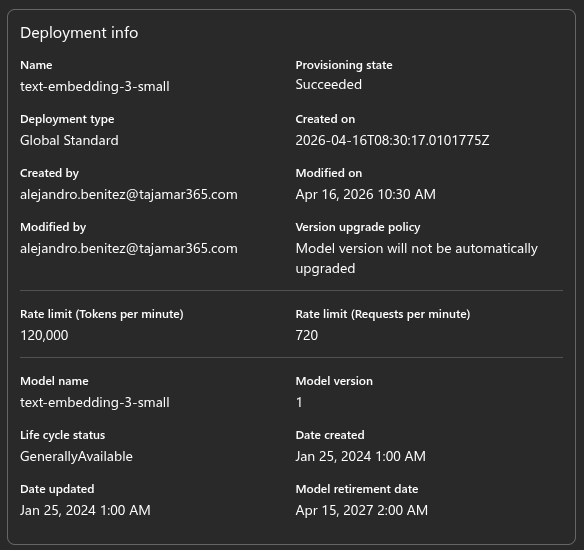
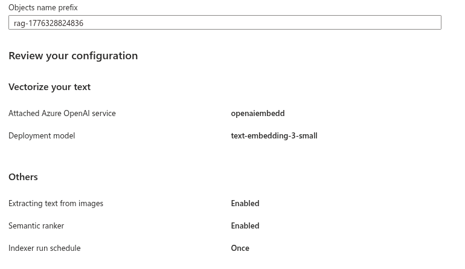
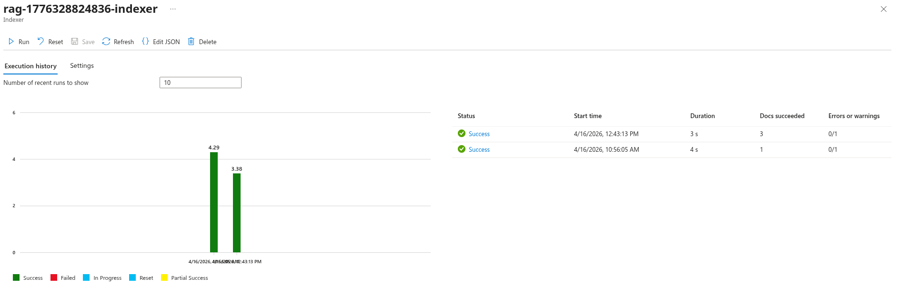
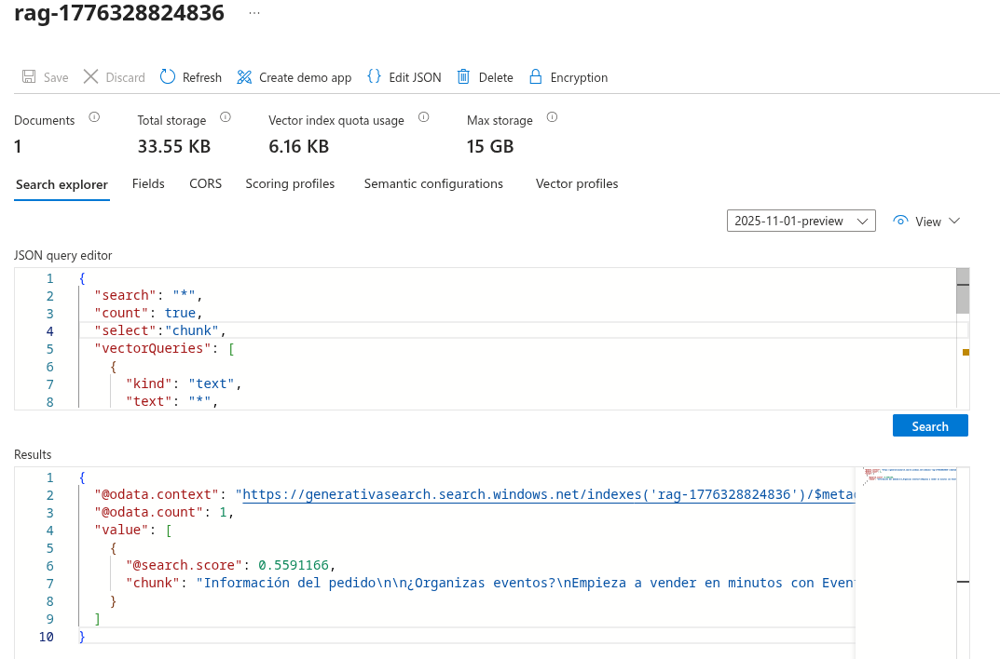
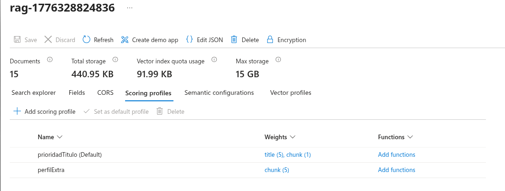

# 🔍 Proyecto Azure AI Search — Implementación de RAG y Búsqueda Híbrida

### Implementación de IA Generativa y Recuperación de Información con Azure

**🚀 VISTA RÁPIDA:** [**📑 Notebook de Pruebas**](./notebooks/ejercicios.ipynb)

---

## 📖 Sobre el Proyecto

Este proyecto documenta el flujo de trabajo para implementar un sistema de **Generación Aumentada por Recuperación (RAG)**. El sistema es capaz de consultar una base de conocimientos técnica (SQL y eventos) para ofrecer respuestas precisas y fundamentadas.

Hemos pasado de una búsqueda tradicional a un ecosistema avanzado que combina **Vectores**, **Búsqueda Híbrida** y **Re-ranking Semántico**, optimizando la relevancia mediante perfiles de puntuación personalizados.

---

## 🏗️ 1. Infraestructura y Configuración del Entorno

En esta fase se desplegaron los tres pilares necesarios para el proyecto. A continuación, se detallan los recursos creados:

| Recurso | Propósito | Captura de Configuración |
| :--- | :--- | :--- |
| **Azure AI Search** | Motor de búsqueda vectorial y semántica. |  |
| **Blob Storage** | Almacenamiento (Data Lake) para los archivos PDF. |  |
| **Azure OpenAI** | Servicio de IA para el modelo de embeddings. |  |

---

## 📥 2. Preparación de Datos y Modelos

Antes de la ingesta, configuramos el acceso seguro y el modelo encargado de la vectorización:

| Componente | Detalle Técnico | Captura |
| :--- | :--- | :--- |
| **Contenedor** | Creación de `embeddingscontainer` para los archivos. |  |
| **Seguridad** | Gestión de Access Keys para la conexión entre servicios. |  |
| **Modelo** | Despliegue de `text-embedding-3-small` (1536 dim). |  |

---

## ⚙️ 3. Pipeline de RAG: Importación y Vectorización

Utilizamos el asistente automático para crear el Skillset (OCR, Merge, Split y Embedding) y el Indexer.

### 3.1 Configuración e Historial
Definimos el prefijo del índice y activamos el **Semantic Ranker**. Tras la ejecución, monitoreamos el historial para confirmar que todos los fragmentos se cargaron correctamente.

> **Fig 1.** *Configuración del asistente RAG.*

> **Fig 2.** *Historial de éxito del indexador.*

---

## 🚀 4. Validación y Resolución de Errores

Esta es la fase de pruebas en el **Search Explorer** y el ajuste fino de la relevancia.

### 4.1 El problema de la densidad de datos
Al inicio del proyecto, las pruebas devolvían resultados idénticos o erróneos. Detectamos que, al tener **solo 1 documento** subido, el motor de búsqueda no tenía suficiente variedad para discriminar resultados. 

> **Fig 3.** *Solución de datos: Tras detectar resultados planos con 1 solo archivo, subimos un set de 15 documentos para que el motor pudiera calcular scores de relevancia reales.*

### 4.2 Scoring Profiles: El error de los campos "Searchable"
Para mejorar la precisión, intentamos priorizar el título del documento, pero nos encontramos con un desafío técnico:

1. **Perfil `prioridadTitulo`:** Fue nuestro primer intento para dar peso al campo `title`. Sin embargo, Azure devolvía error porque el campo `title` no fue marcado como **Searchable** en el esquema original.
2. **Perfil `perfilExtra`:** Como solución, creamos este segundo perfil centrado en el campo `chunk`. Al ser este el campo principal de búsqueda, el peso aplicado permitió alterar el orden de los resultados con éxito.

> **Fig 4.** *Gestión de Perfiles: Vista de ambos perfiles y los pesos aplicados sobre los campos del índice.*

---

> [!TIP]
> ## Aprendizajes Clave
>
> * **Volumen de Datos:** Un sistema RAG necesita una base de conocimientos nutrida para que los algoritmos de similitud de coseno funcionen correctamente.
> * **Esquema de Índice:** Es vital planificar qué campos serán "Searchable" desde el inicio, ya que los Scoring Profiles dependen estrictamente de este atributo.
> * **Búsqueda Semántica:** El re-ranker semántico demostró ser la capa más eficaz para entender consultas complejas sobre conceptos de bases de datos.

---
*Proyecto desarrollado como parte del Máster en IA & Big Data por Alejandro Benítez.*
