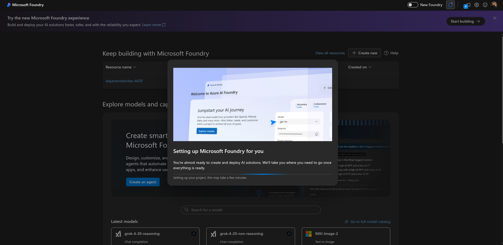
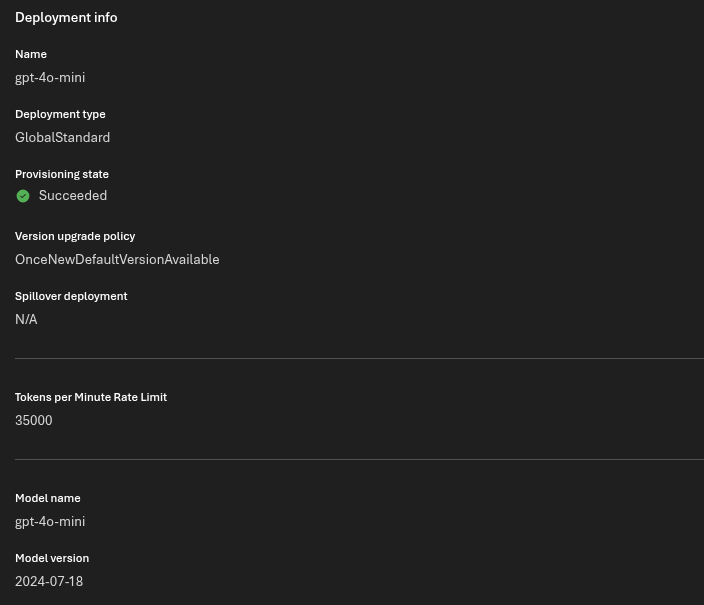
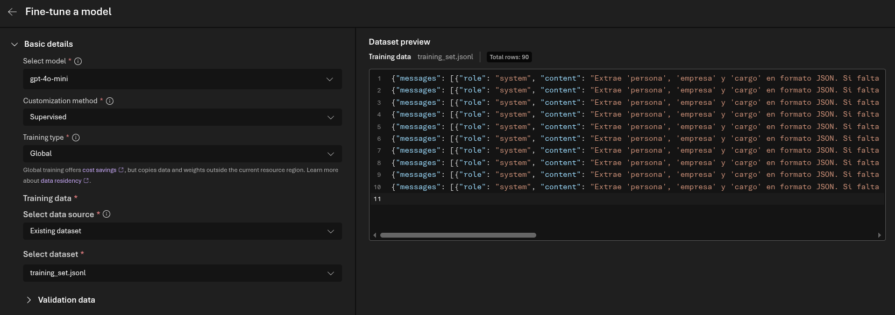
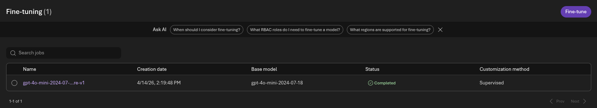
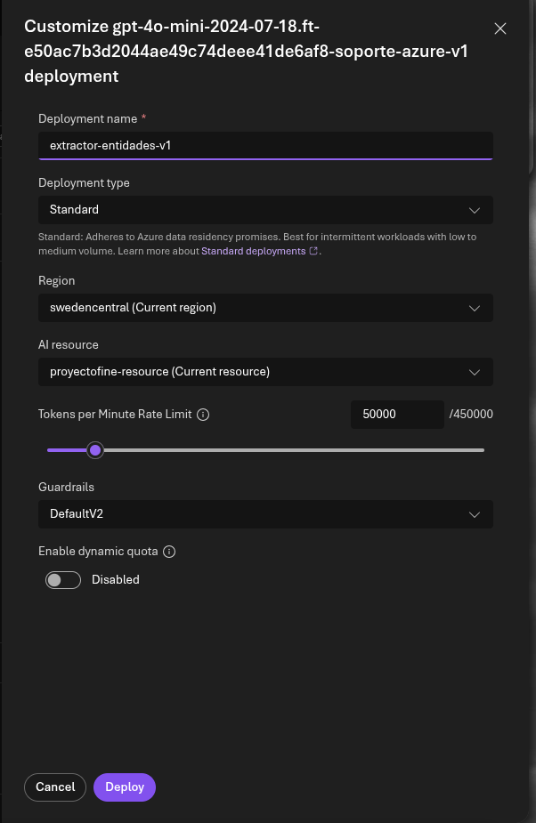
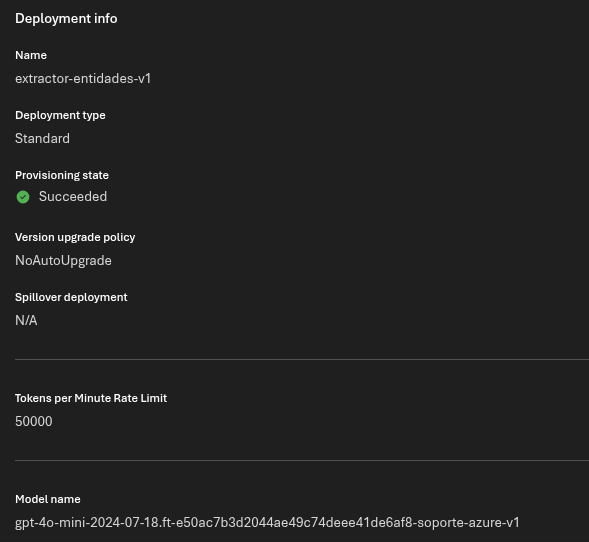

# 🥄 Proyecto Azure AI Foundry — Fine-Tuning y Extracción de Entidades

### Implementación de IA Generativa con AI Foundry

**🚀 VISTA RÁPIDA:** [**📑 Fine-Tuning**](./notebooks/ejercicio.ipynb)

---

## 📖 Sobre el Proyecto

Este proyecto documenta el flujo de trabajo completo para **especializar un modelo lingüístico** en la tarea crítica de extracción de entidades técnicas en formato JSON.

Lo que comenzó como una consulta a un modelo generalista, se ha transformado en un sistema optimizado mediante **Fine-Tuning**. A lo largo del proyecto, se ha preparado un dataset especializado, se ha gestionado el ciclo de vida del entrenamiento en **Azure AI Foundry** y se ha desplegado un endpoint productivo capaz de devolver respuestas deterministas, eliminando la verbosidad innecesaria y garantizando la estructura de datos requerida para sistemas de software.

---

## 🏗️ 1. Preparación y Configuración del Entorno

La primera fase consistió en establecer la infraestructura necesaria en **Azure AI Foundry** para soportar el entrenamiento personalizado.

### 1.1 Configuración de Microsoft Foundry
Validamos el entorno de trabajo y la creación del recurso base para comenzar la gestión de modelos.

> **Fig 1.** *Provisionamiento: Vista del proceso de configuración inicial de Azure AI Foundry para el proyecto.*

### 1.2 El Modelo Base
Como motor de partida, desplegamos una instancia de **GPT-4o-mini**, un modelo balanceado entre rendimiento y coste.

> **Fig 2.** *Modelo Base: Detalles del despliegue gpt-4o-mini utilizado para las pruebas comparativas iniciales.*

> [!TIP]
> Se utilizó Global Standard para el modelo base buscando maximizar la agilidad en las pruebas iniciales.
---

## 🎯 2. Ciclo de Fine-Tuning: Especialización del Modelo

Para que el modelo extraiga 'persona', 'empresa' y 'cargo' con precisión quirúrgica, realizamos un entrenamiento supervisado.

### 2.1 Preparación del Dataset
Cargamos un dataset de 90 filas en formato `.jsonl` con el esquema de mensajes (System, User, Assistant) para enseñar al modelo el comportamiento deseado.

> **Fig 3.** *Ingesta de Datos: Vista previa del dataset `training_set.jsonl` cargado en el portal de AI Foundry.*

### 2.2 Ejecución y Finalización del Job
El proceso de entrenamiento se ejecutó de manera global para optimizar recursos, culminando con éxito tras procesar los ejemplos proporcionados.

> **Fig 4.** *Estado del Entrenamiento: Confirmación del trabajo de Fine-Tuning completado exitosamente.*

---

## 🚀 3. Despliegue del Modelo Personalizado

Una vez obtenido el modelo "especialista", procedimos a crear un endpoint dedicado para su consumo vía API.

### 3.1 Configuración del Deployment
Ajustamos los límites de tasa (TPM) para garantizar la disponibilidad del servicio.

> **Fig 5.** *Customización: Configuración de los Guardrails y límites de tokens para el nuevo modelo fine-tuned.*

> [!TIP]
> Se optó por un despliegue Standard regional. Esto garantiza la coherencia técnica con el recurso de entrenamiento y asegura el cumplimiento de las políticas de residencia de datos en la región seleccionada.

### 3.2 Endpoint Activo
El resultado final es un despliegue operativo listo para recibir peticiones.

> **Fig 6.** *Estado Succeeded: Vista final de los detalles del despliegue `extractor-entidades-v1`.*

---

## 📊 4. Evaluación y Métricas

El proyecto culmina con un análisis exhaustivo en el Notebook, comparando el modelo base vs. el modelo entrenado.

* **Métricas Técnicas:** Se alcanzó una **Training Loss** de prácticamente 0 y una **Accuracy** de 1.0, demostrando una asimilación total del formato JSON.
* **Pruebas de Generalización:** Se validó que el modelo no solo memorizó los datos, sino que es capaz de extraer entidades en casos nuevos y filtrar "ruido" en casos tipo Edge.

---
> [!NOTE]
>## Tecnologías Utilizadas
>
>* **Plataforma de IA:** Azure AI Foundry / Azure OpenAI Service.
>* **Modelos:** GPT-4o-mini (Base) y GPT-4o-mini Fine-Tuned (Especializado).
>* **Lenguajes & Librerías:** Python 3.14+, OpenAI SDK, Pandas, Matplotlib, Python-Dotenv.
>* **Formato de Datos:** JSONL (JSON Lines).

---
> [!WARNING]
>## Desafíos Técnicos y Soluciones
>
>* **Formato de Salida:** El modelo base tendía a incluir explicaciones de texto. El fine-tuning solucionó esto forzando una salida de **JSON puro**.
>* **Seguridad de Credenciales:** Implementación estricta de variables de entorno vía `.env` para evitar la exposición de API Keys en el repositorio.

---
*Proyecto desarrollado como parte del Máster en IA & Big Data por Alejandro Benítez.*
