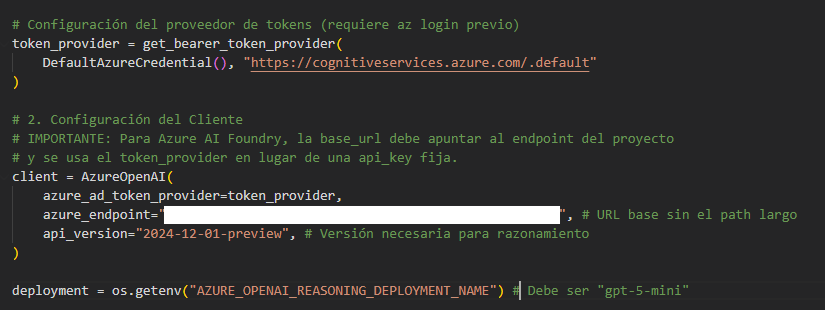
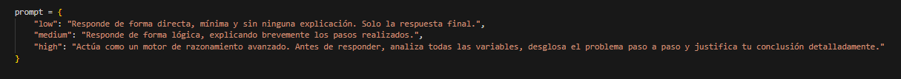
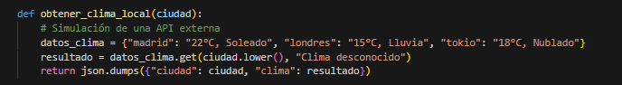

# 🥄 Proyecto Azure AI Foundry — Despliegue, Seguridad y Multimodalidad

### Implementación de IA Generativa con AI Foundry

**🚀 VISTA RÁPIDA:** 

[**🦺 Text, JSON y Guardrails**](./notebooks/ejercicio01.ipynb)

[**🧠 Reasoning y Function Calling**](./notebooks/ejercicio02.ipynb)

[**💻 Modelos Multimodales**](./notebooks/ejercicio03.ipynb)

---

## 📖 Sobre el Proyecto

Este proyecto documenta el flujo de trabajo completo para desplegar, configurar y optimizar modelos de Inteligencia Artificial en la plataforma **Azure AI Foundry**.

A lo que comenzó como un simple chat generativo, se le ha añadido una capa de **IA Responsable** mediante **Límites de protección (Guardrails)**, se ha potenciado su capacidad cognitiva con **Razonamiento avanzado (Reasoning)** y se ha conectado con el mundo exterior mediante **Function Calling**. El proyecto culmina demostrando la potencia **multimodal** de los modelos al analizar su propia infraestructura de seguridad a través de imágenes.

---

## 🔐 1. Despliegue y Límites de Protección (Guardrails)

La primera fase se centró en establecer un entorno de chat seguro y validado. No podemos interactuar con la IA sin un marco de seguridad previo.

### 1.1 El Chat Inicial
Comenzamos validando la conexión y el chat generativo básico.

> **Fig 1.** *Gestión de Modelo: Vista del deployment de GPT 4o mini utilizado como motor de la práctica.*

### 1.2 Configuración de Seguridad (Guardrails)
Para profesionalizar el chat, implementamos una política de seguridad robusta para filtrar el contenido inapropiado o peligroso.

| Configuración de Filtros | Selección de Modelos | Confirmación |
| :--- | :--- | :--- |
|  |  |  |
| *Definición de umbrales para Odio, Violencia, Autolesiones y Jailbreak.* | *Vinculación de la política de seguridad a los deployments activos (4o/4o-mini).* | *Vista final del Guardrail creado y activo.* |

* **Implementación Técnica:** El código de chat intercepta el intento de respuesta. Si el Guardrail detecta una infracción (Hate, Violence, etc.), el sistema lanza una excepción `content_filter` que gestionamos para dar una respuesta amigable al usuario, bloqueando la salida original.

---

## 🧠 2. AI Pipeline: Razonamiento y Funciones

Para transformar el chat en un agente resolutivo, profundizamos en la lógica del modelo y su capacidad de acción.

### 2.1 Razonamiento Nativo: GPT 5 mini VS GPT 4o

En esta fase, marcamos un salto evolutivo en el proyecto. Mientras que con **GPT-4o** el razonamiento se emulaba mediante técnicas de **Prompt Engineering** en el *System Message*, con el nuevo **gpt-5-mini** utilizamos capacidades de **Cadena de Pensamiento** integradas directamente en el núcleo del modelo.

Para gestionar el acceso a este modelo de última generación, implementamos una autenticación segura basada en **Azure Identity**.

  
> **Fig 2.** *Configuración del Client con Token Provider para GPT 5 mini: Implementación de DefaultAzureCredential para una conexión robusta y profesional sin exposición de secretos.*

> **Fig 2.** *Ante la falta del parámetro nativo en GPT 4o, **solucionamos el reto técnico** emulando los niveles de razonamiento (*Low, Medium, High*) mediante **ingeniería de prompts** en el System Message.*

#### **Control del Esfuerzo Cognitivo (Reasoning Effort)**

A diferencia de los modelos estándar, el parámetro nativo `reasoning_effort` permite graduar con precisión el tiempo que el modelo "reflexiona" antes de emitir una respuesta final:

##### **Nivel LOW (Optimización)**
* **Diferencia:** Es el equivalente al comportamiento de GPT-4o pero con mayor coherencia lógica interna.
* **Uso ideal:** Tareas directas donde buscamos **latencia mínima** y ahorro de tokens.

##### **Nivel MEDIUM (Equilibrio)**
* **Diferencia:** Realiza validaciones intermedias que GPT-4o solía saltarse a menos que se le indicara explícitamente.
* **Uso ideal:** Tareas de razonamiento moderado y redacción de contenido técnico.

##### **Nivel HIGH (Análisis Profundo)**
* **Diferencia:** El modelo activa su máxima capacidad de reflexión. Desglosa variables complejas en un espacio de pensamiento privado antes de responder, algo imposible de replicar solo con prompts en modelos anteriores.
* **Uso ideal:** **Lógica compleja**, **matemáticas avanzadas** o **depuración de código crítico** donde la precisión es la prioridad absoluta.

> [!IMPORTANT]  
> **Nota Técnica de Implementación:** Al operar con **gpt-5-mini**, el pipeline se vuelve más eficiente al eliminar parámetros de muestreo como **temperature** o **top_p**. El modelo toma el control total de su variabilidad durante la fase de razonamiento interna para garantizar la máxima consistencia.

### 2.2 Conectividad mediante Function Calling

Es la capacidad de la IA para usar herramientas externas. El modelo detecta que necesita información en tiempo real (como datos meteorológicos), genera las instrucciones en JSON y espera a que nuestro código le devuelva el dato para cerrar la respuesta. Convierte al chat en un agente activo.

> **Fig 3.** *Como no hay **API**, simulamos una externa.*

---

## 👁️ 3. Experiencia Multimodal (Visión)

El proyecto termina con la validación de la multimodalidad nativa de **GPT-4o**, integrando visión y texto.

> **Fig 4.** *Deployment de Visión: Vista del modelo GPT-4o utilizado como motor multimodal.*

### Validación de la Infraestructura
Como prueba de concepto multimodal, enviamos al modelo la captura de pantalla de la propia configuración de los Guardrails.

* **Reto:** El modelo analizó la imagen `img/guardrails.png`, identificando correctamente qué categorías de seguridad (Hate, Violence, Jailbreak) habíamos activado en el paso anterior y a qué nivel.

---

## 🛠️ Tecnologías Utilizadas

* **Plataforma de IA:** Azure AI Foundry / Azure OpenAI Service.
* **Modelos:** GPT-4o, y GPT-4o-mini (Visión).
* **Lenguajes & Librerías:** Python 3.10+, OpenAI SDK, Python-Dotenv, IPython.
* **Seguridad:** Azure Content Safety (Límites de protección).

---

## ⚠️ Desafíos Técnicos y Soluciones

* **Hardcoding de Credenciales:** Solucionado mediante el uso de un archivo `.env` cargado vía `os.getenv()`.
* **Limitaciones de Audio:** Se documentó la ausencia de pruebas de audio debido a las restricciones de disponibilidad regional actuales en la infraestructura de Azure.

---
*Proyecto desarrollado como parte del Máster en IA & Big Data por Alejandro Benítez.*
