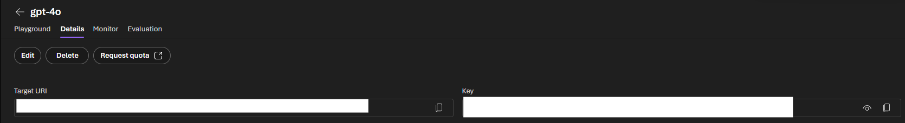
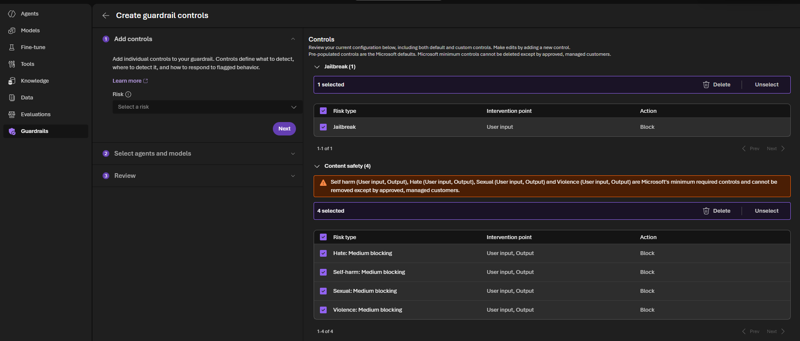
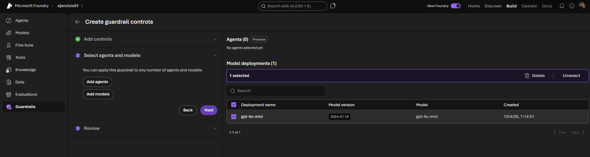
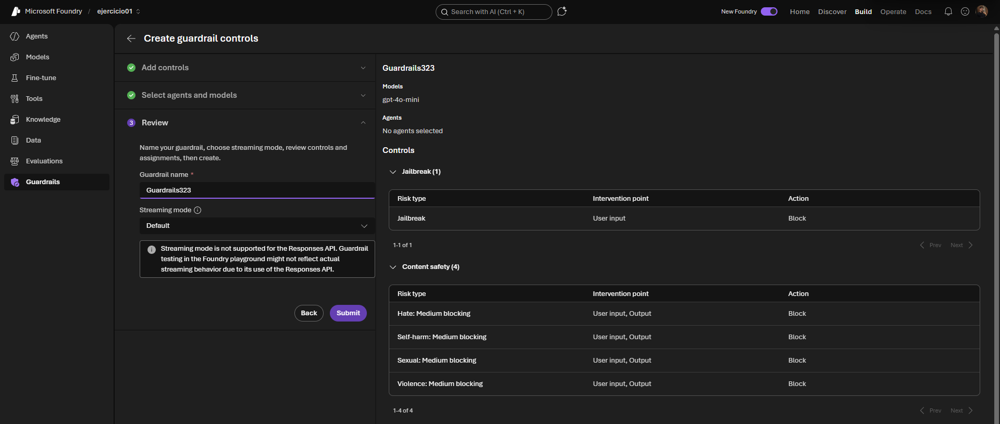
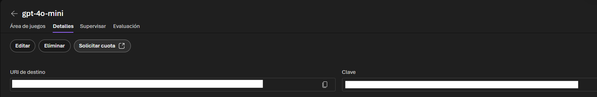

# 🥄 Proyecto Azure AI Foundry — Despliegue, Seguridad y Multimodalidad

### Implementación de IA Generativa Responsable con AI Foundry

> **🚀 VISTA RÁPIDA:** Puedes explorar la lógica central de los notebooks y la interacción con la API aquí: [**📁 htmls/**](./)

---

## 📖 Sobre el Proyecto

Este proyecto documenta el flujo de trabajo completo para desplegar, configurar y optimizar modelos de Inteligencia Artificial en la plataforma **Azure AI Foundry**.

A lo que comenzó como un simple chat generativo, se le ha añadido una capa de **IA Responsable** mediante **Límites de protección (Guardrails)**, se ha potenciado su capacidad cognitiva con **Razonamiento avanzado (Reasoning)** y se ha conectado con el mundo exterior mediante **Function Calling**. El proyecto culmina demostrando la potencia **multimodal** de los modelos al analizar su propia infraestructura de seguridad a través de imágenes.

---

## 🔐 1. Despliegue y Límites de Protección (Guardrails)

La primera fase se centró en establecer un entorno de chat seguro y validado. No podemos interactuar con la IA sin un marco de seguridad previo.

### 1.1 El Chat Inicial
Comenzamos validando la conexión y el chat generativo básico.

> **Fig 1.** *Gestión de Modelos: Vista de los deployments de GPT-4o y o1-mini utilizados como motores de la práctica.*

### 1.2 Configuración de Seguridad (Guardrails)
Para profesionalizar el chat, implementamos una política de seguridad robusta para filtrar el contenido inapropiado o peligroso.

| Configuración de Filtros | Selección de Modelos | Confirmación |
| :--- | :--- | :--- |
|  |  |  |
| *Definición de umbrales para Odio, Violencia, Autolesiones y Jailbreak.* | *Vinculación de la política de seguridad a los deployments activos (4o/4o-mini).* | *Vista final del Guardrail creado y activo.* |

* **Implementación Técnica:** El código de chat intercepta el intento de respuesta. Si el Guardrail detecta una infracción (Hate, Violence, etc.), el sistema lanza una excepción `content_filter` que gestionamos para dar una respuesta amigable al usuario, bloqueando la salida original.

---

## 🧠 2. AI Pipeline: Razonamiento y Funciones

Para transformar el chat en un agente resolutivo, profundizamos en la lógica del modelo y su capacidad de acción.

### 2.1 Razonamiento Parametrizado (Reasoning)
Diferenciamos el comportamiento predictivo estándar del pensamiento nativo profundo.

* **Modelo o1-mini:** Utilizado para problemas lógicos complejos mediante el parámetro nativo `reasoning_effort`.
* **Modelo GPT-4o:** Ante la falta del parámetro nativo en este modelo, **solucionamos el reto técnico** emulando los niveles de razonamiento (*Low, Medium, High*) mediante **ingeniería de prompts** en el System Message.

### 2.2 Conectividad mediante Function Calling
Superamos la limitación del conocimiento estático del modelo. Habilitamos la capacidad para que la IA decida cuándo usar una herramienta externa.

* **Flujo:** El modelo identifica una intención del usuario (ej. consultar precio), genera un JSON con los parámetros, nosotros ejecutamos la función en Python y le devolvemos el resultado en tiempo real para formular la respuesta final.

---

## 👁️ 3. Experiencia Multimodal (Visión)

El proyecto culmina con la validación de la multimodalidad nativa de **GPT-4o-mini**, integrando visión y texto.

> **Fig 2.** *Deployment de Visión: Vista del modelo GPT-4o-mini utilizado como motor multimodal.*

### Validación de la Infraestructura
Como prueba de concepto multimodal, enviamos al modelo las capturas de pantalla de la propia configuración de los Guardrails.

* **Reto:** El modelo analizó la imagen `img/guardrails.png`, identificando correctamente qué categorías de seguridad (Hate, Violence, Jailbreak) habíamos activado en el paso anterior y a qué nivel.

---

## 🛠️ Tecnologías Utilizadas

* **Plataforma de IA:** Azure AI Foundry / Azure OpenAI Service.
* **Modelos:** GPT-4o, y GPT-4o-mini (Visión).
* **Lenguajes & Librerías:** Python 3.10+, OpenAI SDK, Python-Dotenv, IPython.
* **Seguridad:** Azure Content Safety (Límites de protección).

---

## ⚠️ Desafíos Técnicos y Soluciones

* **Hardcoding de Credenciales:** Solucionado mediante el uso de un archivo `.env` cargado vía `os.getenv()`.
* **Limitaciones de Audio:** Se documentó la ausencia de pruebas de audio debido a las restricciones de disponibilidad regional actuales en la infraestructura de Azure.

---
*Proyecto desarrollado como parte del Máster en IA & Big Data por Alejandro Benítez.*
