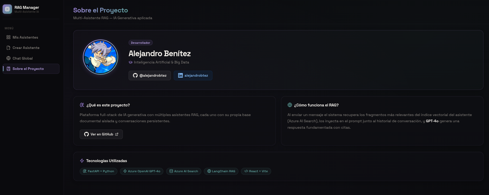
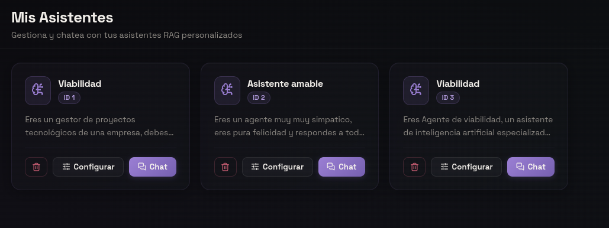
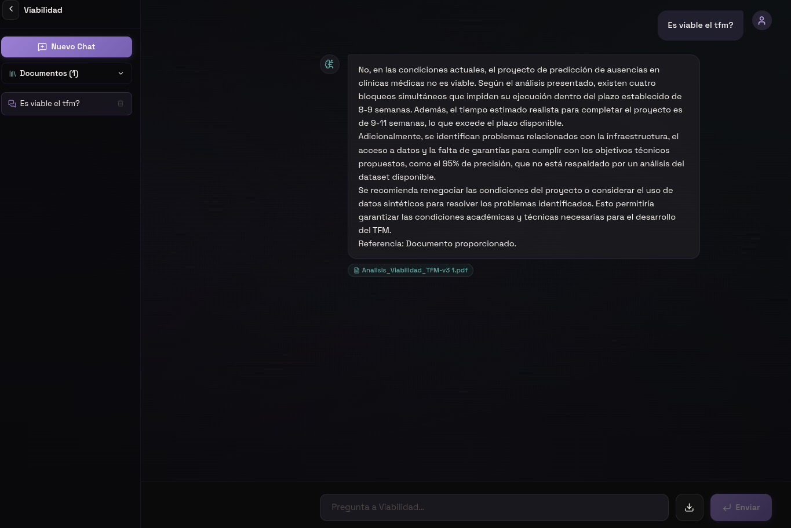
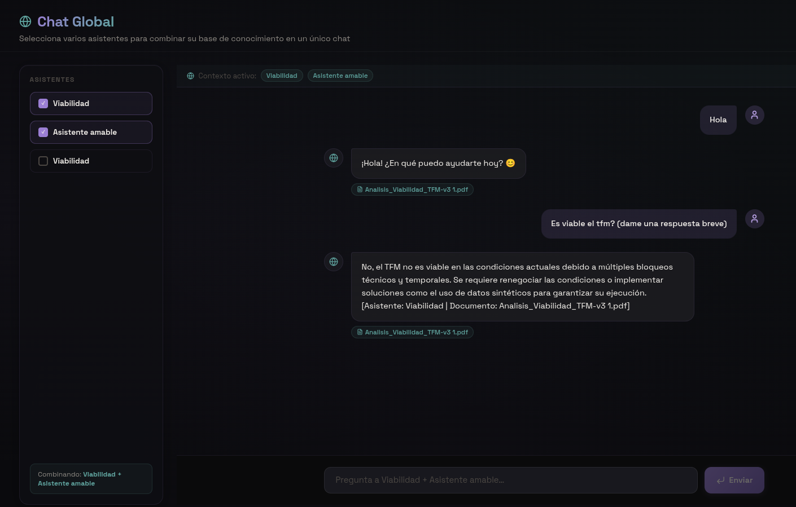

# 🤖 Multi-Asistente RAG — Plataforma de IA Generativa

### Aplicación full-stack para crear y gestionar asistentes IA con base documental propia

**🚀 VISTA RÁPIDA:** [**📂 Repositorio del Proyecto**](https://github.com/alejandrobtez/IA_Generativa/tree/main/RAG_Multi_Agent)

---

## 📖 Sobre el Proyecto

Esta plataforma permite crear y gestionar **múltiples asistentes IA personalizados**, cada uno con sus propias instrucciones de sistema y base de conocimiento documental independiente. Construida sobre **Azure OpenAI**, **Azure AI Search** y **LangChain**.

Cada asistente tiene su propio índice vectorial aislado en Azure AI Search. Al chatear, el sistema:

1. Reformula la pregunta teniendo en cuenta el historial de conversación.
2. Recupera los fragmentos más relevantes del índice **exclusivo** de ese asistente.
3. Inyecta el contexto recuperado en el prompt junto al historial.
4. GPT-4o genera una respuesta fundamentada con citas de los documentos fuente.

El asistente **nunca mezcla información entre asistentes** y declina responder si la información no está en su base documental.


> **Fig 1.** *Vista general de la plataforma: información del proyecto y descripción de la arquitectura multi-asistente.*

---

## 🏗️ 1. Arquitectura del Sistema

```
RAG/
├── backend/
│   ├── main.py                  # FastAPI app + CORS
│   ├── schemas.py               # Modelos Pydantic (validación de datos)
│   ├── storage.py               # Sistema de persistencia JSON (sin BD)
│   ├── routers/
│   │   ├── assistants.py        # CRUD asistentes + generación de instrucciones
│   │   ├── documents.py         # Subida e ingesta de documentos
│   │   ├── conversations.py     # Chat + pipeline RAG
│   │   └── mix.py               # Chat Global (mezcla de asistentes)
│   ├── services/
│   │   └── rag_service.py       # Ingesta, embeddings, Azure AI Search
│   ├── data/                    # Persistencia JSON (ver sección siguiente)
│   │   ├── assistants.json
│   │   ├── documents.json
│   │   ├── conversations.json
│   │   └── messages.json
│   └── uploads/                 # Archivos originales subidos por el usuario
│
├── frontend/
│   └── src/
│       ├── App.jsx              # Router + sidebar
│       ├── api.js               # Capa de llamadas HTTP (axios)
│       └── pages/
│           ├── Dashboard.jsx        # Lista de asistentes
│           ├── CreateAssistant.jsx  # Formulario de creación
│           ├── AssistantView.jsx    # Configuración + base documental
│           ├── ChatView.jsx         # Chat con asistente individual
│           ├── MixView.jsx          # Chat Global (multi-asistente)
│           └── AboutView.jsx        # Información del proyecto
│
└── img/
    └── ...                      # Capturas de la plataforma
```


> **Fig 2.** *Dashboard: asistentes ya creados con sus instrucciones de sistema configuradas individualmente.*

---

## 💾 2. Almacenamiento sin Base de Datos

Este proyecto **no usa ninguna base de datos relacional** (ni SQLite, ni PostgreSQL, ni ninguna otra). Toda la persistencia se gestiona mediante **cuatro archivos JSON** ubicados en `backend/data/`:

| Archivo | Qué almacena |
|---|---|
| `assistants.json` | Nombre, descripción e instrucciones de cada asistente |
| `documents.json` | Metadatos de archivos subidos (nombre, ruta, asistente al que pertenece) |
| `conversations.json` | Conversaciones de chat con su título y asistente asociado |
| `messages.json` | Mensajes individuales (rol, contenido, citas, timestamp) |

### 2.1 Cómo funciona `JSONStore`

La clase `JSONStore` en `storage.py` gestiona cada archivo JSON con las siguientes características:

- **Carga en memoria** al iniciar la aplicación.
- **Lock de hilo** (`threading.Lock`) para evitar condiciones de carrera en escrituras concurrentes.
- **Persistencia inmediata**: cada inserción, actualización o borrado reescribe el archivo JSON al disco.
- **IDs autoincrementales**: el `id` de cada registro se genera como `max(ids_existentes) + 1`.
- **Timestamps UTC automáticos**: `created_at` se asigna en el momento del `insert`.

```python
# Ejemplo de uso en el código
assistant = assistants_store.insert({"name": "Mi Asistente", "instructions": "..."})
# → {"id": 1, "name": "Mi Asistente", "created_at": "2026-04-27T10:00:00+00:00", ...}

assistants_store.update(1, {"name": "Nuevo Nombre"})
assistants_store.delete(1)
assistants_store.filter(assistant_id=3)  # Filtro por cualquier campo
```

### 2.2 Almacenamiento vectorial (Azure AI Search)

Los embeddings y chunks de documentos **no se guardan en JSON** — se almacenan en **Azure AI Search**, un servicio de búsqueda vectorial en la nube.

> [!NOTE]
> Se crea **un índice separado por asistente**, con el nombre `{AZURE_SEARCH_INDEX_NAME}-{assistant_id}`. Esto garantiza aislamiento total entre asistentes. Los archivos originales (PDF, DOCX, TXT, PPTX) se guardan físicamente en `backend/uploads/` con el nombre `{document_id}_{filename_original}`.

---

## 📥 3. Pipeline de Ingesta

Cuando el usuario sube un documento, se ejecuta el siguiente pipeline:

```
Archivo (PDF / DOCX / TXT / PPTX / MD)
        │
        ▼
Loader específico por extensión
  • .pdf   → PyMuPDFLoader
  • .docx  → Docx2txtLoader
  • .txt   → TextLoader
  • .pptx  → UnstructuredPowerPointLoader
        │
        ▼
RecursiveCharacterTextSplitter
  chunk_size = 1000 caracteres
  chunk_overlap = 200 caracteres
        │
        ▼
Metadatos inyectados en cada chunk:
  { "document_id": N, "filename": "archivo.pdf" }
        │
        ▼
AzureOpenAIEmbeddings  →  vector de 1536 dimensiones por chunk
        │
        ▼
Azure AI Search — índice: asistente-{assistant_id}
```

> [!TIP]
> Una vez subidos los documentos, el botón **Generar con IA** analiza el contenido completo y redacta automáticamente las instrucciones de sistema del asistente, adaptadas al material cargado.

---

## 🔍 4. Pipeline RAG (Recuperación y Generación)

Cuando el usuario envía un mensaje al chat:

```
Pregunta del usuario + historial de conversación
        │
        ▼
history_aware_retriever
  → Reformula la pregunta para que sea autónoma
    (sin dependencia implícita del historial)
        │
        ▼
Azure AI Search — top-5 chunks más similares
  (solo del índice del asistente activo)
        │
        ▼
create_stuff_documents_chain
  Prompt = instrucciones del asistente
         + fragmentos recuperados
         + historial de mensajes
         + pregunta del usuario
        │
        ▼
GPT-4o (Azure OpenAI, temperature=0)
        │
        ▼
Respuesta + lista de documentos fuente (citas)
        │
        ▼
Guardado en messages.json
```


> **Fig 3.** *Ejemplo real: asistente configurado para analizar la viabilidad de un proyecto a partir de los documentos subidos, con citas de los fragmentos fuente.*

---

## 🌐 5. Chat Global — Mezcla Real de Asistentes

El **Chat Global** permite consultar simultáneamente las bases documentales de **múltiples asistentes** en una única conversación. Es la funcionalidad que diferencia esta plataforma de un RAG convencional.

### 5.1 Cómo funciona la mezcla real

```
Pregunta del usuario
        │
        ├─→ Retriever Asistente A  →  top-5 chunks de índice asistente-A
        ├─→ Retriever Asistente B  →  top-5 chunks de índice asistente-B
        └─→ Retriever Asistente N  →  top-5 chunks de índice asistente-N
                    │
                    ▼
Contexto combinado — cada chunk etiquetado con su origen:
  [Asistente: A | Documento: manual_rrhh.pdf]
  Lorem ipsum...
  ---
  [Asistente: B | Documento: informe_ventas.pdf]
  Lorem ipsum...
                    │
                    ▼
GPT-4o recibe TODO el contexto combinado
+ historial de la conversación del Chat Global
                    │
                    ▼
Respuesta unificada + citas de todos los documentos
```


> **Fig 4.** *Chat Global en acción: consulta simultánea a varios asistentes con sus bases documentales fusionadas en tiempo real.*

### 5.2 Garantías del Chat Global

- Cada asistente tiene su propio índice en Azure AI Search: **los índices nunca se mezclan a nivel de almacenamiento**.
- La mezcla ocurre **solo en el contexto del prompt**, controlada explícitamente.
- Cada chunk lleva su etiqueta de asistente y documento: el LLM sabe exactamente de dónde viene cada fragmento.
- Si un índice no tiene información relevante para la pregunta, simplemente no aporta chunks útiles (no falla).
- Si ningún índice tiene información, el sistema lo indica explícitamente en lugar de inventar.

---

## ⚡ 6. Funcionalidades

| Funcionalidad | Descripción |
|---|---|
| **Multi-asistente** | Crea tantos asistentes como necesites, cada uno con instrucciones únicas |
| **Base documental** | Sube PDF, DOCX, TXT, PPTX, MD a cada asistente |
| **Aislamiento total** | Índice Azure AI Search separado por asistente |
| **Generar instrucciones con IA** | Analiza los documentos subidos y genera automáticamente las instrucciones de sistema |
| **Chat persistente** | Historial guardado en JSON y memoria conversacional entre turnos |
| **Título automático** | El primer mensaje del usuario se usa como título del chat |
| **Citas de fuentes** | Cada respuesta referencia los documentos consultados |
| **Sin alucinaciones** | El LLM solo responde con contexto real o declina explícitamente |
| **Exportar chat** | Descarga cualquier conversación como archivo Markdown |
| **Chat Global** | Combina los índices de varios asistentes en un único chat |

---

> [!NOTE]
> ## 🛠️ Stack Tecnológico
>
> | Capa | Tecnología |
> |---|---|
> | **Backend** | Python 3.12, FastAPI |
> | **LLM** | Azure OpenAI GPT-4o |
> | **Embeddings** | Azure OpenAI `text-embedding-ada-002` |
> | **Búsqueda vectorial** | Azure AI Search (un índice por asistente) |
> | **Orquestación RAG** | LangChain (`langchain`, `langchain-openai`, `langchain-community`) |
> | **Persistencia estructurada** | JSON en disco (sin base de datos) |
> | **Frontend** | React 18 + Vite, CSS Glassmorphism dark |

---

## ⚙️ 7. Instalación y Ejecución

### 7.1 Requisitos previos

- Python 3.10+
- Node.js 18+
- Cuenta Azure con:
  - **Azure OpenAI** con deployments de chat (`gpt-4o`) y embeddings (`text-embedding-ada-002`)
  - **Azure AI Search** (tier Basic o superior)

### 7.2 Backend

```bash
cd backend
python3 -m venv venv
source venv/bin/activate   # Windows: venv\Scripts\activate
pip install -r requirements.txt
```

Crea `backend/.env` con tus credenciales:

```env
# Chat (GPT-4o)
AZURE_OPENAI_CHAT_ENDPOINT=https://<recurso>.openai.azure.com/
AZURE_OPENAI_CHAT_KEY=<api-key>
AZURE_OPENAI_CHAT_DEPLOYMENT=gpt-4o
AZURE_OPENAI_CHAT_API_VERSION=2024-02-15-preview

# Embeddings
AZURE_OPENAI_EMBEDDING_ENDPOINT=https://<recurso>.openai.azure.com/
AZURE_OPENAI_EMBEDDING_KEY=<api-key>
AZURE_OPENAI_EMBEDDING_DEPLOYMENT=text-embedding-ada-002
AZURE_OPENAI_EMBEDDING_API_VERSION=2023-05-15

# Azure AI Search
AZURE_SEARCH_ENDPOINT=https://<servicio>.search.windows.net
AZURE_SEARCH_KEY=<admin-key>
AZURE_SEARCH_INDEX_NAME=asistente
```

```bash
uvicorn main:app --reload
# API en http://localhost:8000
# Docs interactivas en http://localhost:8000/docs
```

> [!TIP]
> Una vez arrancado, accede a `http://localhost:8000/docs` para explorar todos los endpoints de la API de forma interactiva con Swagger UI.

### 7.3 Frontend

```bash
cd frontend
npm install
npm run dev
# App en http://localhost:5173
```

---

## 🚀 8. Uso

1. Abre `http://localhost:5173`.
2. En **Mis Asistentes**, pulsa **Crear Asistente** — introduce nombre, descripción e instrucciones de sistema.
3. Entra en **Configurar** y sube documentos (PDF, DOCX, TXT…). Una vez subidos, usa el botón **Generar con IA** para que el sistema analice los documentos y redacte las instrucciones automáticamente.
4. Pulsa **Chat** e inicia una conversación. El primer mensaje que envíes se convierte automáticamente en el título del chat.
5. Las respuestas incluyen **citas** de los documentos fuente. Puedes descargar cualquier conversación con el botón ↓ (Markdown).
6. Para consultar varios asistentes a la vez, usa **Chat Global**: selecciona los asistentes que quieras y el sistema fusionará sus bases documentales en tiempo real.

---

## 🛡️ 9. Garantías del Sistema

| Propiedad | Implementación |
|---|---|
| Aislamiento entre asistentes | Índice Azure AI Search separado por `assistant_id` |
| Sin contaminación cruzada | El retriever solo accede al índice del asistente activo |
| Memoria conversacional | `history_aware_retriever` reformula preguntas con contexto del historial |
| Anti-alucinaciones | Prompt explícito: responder solo con contexto recuperado o declinar |
| Trazabilidad de respuestas | Metadato `filename` en cada chunk → citas visibles en la UI |
| Concurrencia segura | `threading.Lock` en `JSONStore` para escrituras concurrentes |
| Chat Global etiquetado | Cada chunk lleva `[Asistente: X \| Documento: Y]` antes de enviarse al LLM |

---

> [!WARNING]
> ## Seguridad de Credenciales
>
> Nunca incluyas tus API Keys directamente en el código. Este proyecto utiliza un archivo `backend/.env` que debe añadirse a `.gitignore` para evitar exponer credenciales de Azure OpenAI y Azure AI Search en el repositorio.

---

*Proyecto desarrollado como parte del Máster en IA & Big Data por Alejandro Benítez.*  
[GitHub](https://github.com/alejandrobtez) · [LinkedIn](https://www.linkedin.com/in/alejandrobtez)
